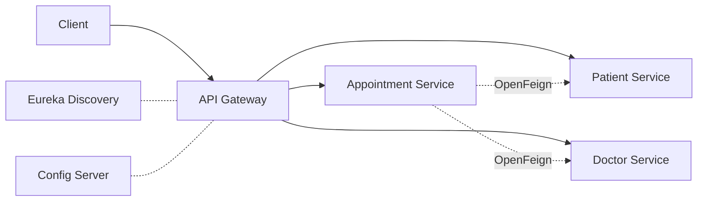
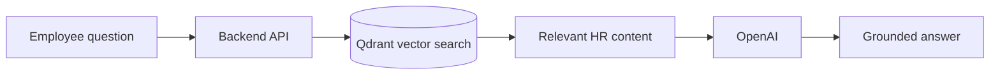

# Akshay Kumar

### Java Backend Engineer

Building secure, scalable backend systems with **Spring Boot**, **PostgreSQL** and **AWS**, and adding **AI** on top.

📍 Bengaluru, India  ·  💼 2+ years experience  ·  🟢 Open to opportunities

---

## 👨‍💻 About

I'm a software engineer who builds production backend systems for HRMS, ERP and workflow platforms used by **hundreds of employees** and **100+ client organizations**. I care about clean REST APIs, secure services, and performance that holds up as usage grows.

Lately I've been combining backend engineering with **GenAI**, including a RAG-based HR assistant that cut employee queries by half.

## 📊 Impact at a glance

| ⚡ **40%** | 👥 **350+** | 🏢 **112+** | 🚀 **20+** | 🤖 **50%** |
|:---:|:---:|:---:|:---:|:---:|
| lower P95 API latency with Redis caching | employees on workflow and attendance platforms | client orgs on a JWT-secured ticketing system | production features shipped (payroll, leave, shifts) | fewer HR queries via RAG chatbot |

## 🛠️ Tech Stack

<table>
<tr>
<td><b>Backend</b></td>
<td>

</td>
</tr>
<tr>
<td><b>Data</b></td>
<td>

</td>
</tr>
<tr>
<td><b>Cloud & DevOps</b></td>
<td>

</td>
</tr>
<tr>
<td><b>Frontend</b></td>
<td>

</td>
</tr>
<tr>
<td><b>Testing & AI</b></td>
<td>

</td>
</tr>
</table>

## 💼 Experience

**Software Engineer · Novel Office India** · Oct 2025 – Present
- Migrated legacy Node.js services to Spring Boot across HRMS modules (Spring Data JPA, Hibernate, PostgreSQL)
- Built ticketing, task assignment, RBAC and escalation workflows for a platform used by 350+ employees
- Added Redis caching to read-heavy APIs, cutting P95 latency by 40%
- Built an attendance and leave management system with Spring Boot, React and Redis

**Junior Software Developer · Impulse International** · Oct 2024 – Oct 2025
- Delivered 20+ production features across payroll, attendance, leave and shift management
- Built a JWT-secured ticket resolution system with 3-tier escalation for 112+ client organizations
- Built a RAG-based HR chatbot (OpenAI, Qdrant, Docker, AWS) over a 287-page knowledge base

## 🚀 Featured Projects

### 🏥 Clinic Management System: Microservices

Distributed system with independent Patient, Doctor and Appointment services, each with its own database.

- Service discovery and inter-service calls with **Eureka** and **OpenFeign**
- **Spring Cloud Gateway** and **Config Server** for routing and centralized configuration
- **Resilience4j** circuit breakers and retries, **JWT** security, containerized with **Docker**

`Java 21` `Spring Boot` `Spring Cloud` `PostgreSQL` `Docker`

<!-- Add repository link: https://github.com/akshaysharmav7/<repo-name> -->

### ✍️ Blog Sphere: Full Stack Content Platform

Full-stack blogging platform with blog, category, tag and draft management.
- **JWT** authentication and role-based authorization with Spring Security
- Protected REST endpoints with DTO-based API contracts

`Java 21` `Spring Boot 3` `React 18` `PostgreSQL` `Docker`

<!-- Add repository link: https://github.com/akshaysharmav7/<repo-name> -->

### 🤖 RAG-based HR Assistant

AI chatbot that answers employee questions from a 287-page HR knowledge base, reducing HR queries by 50%.

`Node.js` `React` `OpenAI` `Qdrant` `Docker` `AWS`

## 🎯 Currently

Looking for **Java backend and full-stack roles** where I can own features end to end, build scalable services, and work on AI-enabled products.

## 🎓 Education & Achievements

- **B.Tech, Computer Science**, Sharda University (2025)
- **University-level winner**, Solving for India Hackathon 2023 (Google, AMD, GeeksforGeeks)

---

*Open to opportunities. Let's talk on [LinkedIn](https://linkedin.com/in/akshaysharmav) or [email](mailto:akshaysharmav7@gmail.com).*

